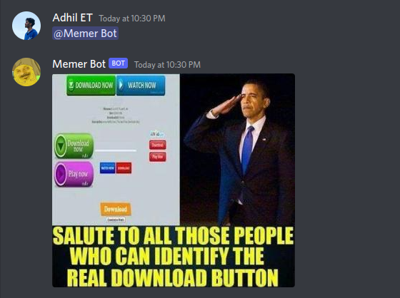

<p align="center">
  <a href="https://github.com/rijfas/saturday-hack-night-dialogflow">
    
  </a>

  <h2 align="center"><b>Memer Bot</b></h2>

  <p align="center">
    A Simple Discord Meme Generator Bot 
    <br />
    <a href="https://github.com/hadibinnoor/SHN-Discord-API"><strong>Explore the docs »</strong></a>
    <br />
    <a href="https://discord.com/api/oauth2/authorize?client_id=1038441968776257566&permissions=67648&scope=bot%20applications.commands">Add to your discord server</a>
    ·
    <a href="https://github.com/hadibinnoor/SHN-Discord-API/issues">Report Bug</a>
    ·
    <a href="https://github.com/hadibinnoor/SHN-Discord-API/issues">Request Feature</a>
  </p>
</p>

<br>
<details open="open">
  <summary>Table of Contents</summary>
  <ol>
    <li>
      <a href="#about-the-project">About The Project</a>
      <ul>
        <li><a href="#built-with">Built With</a></li>
      </ul>
    </li>
    <li>
      <a href="#getting-started">Getting Started</a>
      <ul>
        <li><a href="#prerequisites">Prerequisites</a></li>
        <li><a href="#installation">Installation</a></li>
      </ul>
    </li>
    <li><a href="#usage">Usage</a></li>
    <li><a href="#roadmap">Roadmap</a></li>
    <li><a href="#contributing">Contributing</a></li>
    <li><a href="#license">License</a></li>
    <li><a href="#contact">Contact</a></li>
    <li><a href="#contributers">Contributers</a></li>
  </ol>
</details>

<!-- ABOUT THE PROJECT -->
<br>

## About The Project

Memer Bot is a virtual friend who generate Memes.
You could deploy him as discord bot or CLI tool

Here's why:

- It keeps your discord server alive.
- It gives you relief when you get weird by errors


### Built With

- [Python](https://www.python.org/)
- [Flask](https://flask.palletsprojects.com/)
- [Replit](https://replit.com/)
- [UptimeRobot](https://uptimerobot.com/)

<!-- GETTING STARTED -->

<br>

## Getting Started

This is an example of how you may give instructions on setting up your project locally.
To get a local copy up and running follow these simple example steps.

### Prerequisites

This is an example of how to list things you need to use the software and how to install them.

### Installation

1. Clone the repo
   ```sh
   https://github.com/hadibinnoor/SHN-Discord-API
   ```
2. Install required packages
   ```sh
   pip install -r requirements.txt
   ```
3. Enter your TOKEN
   ```py
   TOKEN = ''
   ```

<!-- USAGE EXAMPLES -->
<br>

## Usage

You can just run the cli tool or use a cloud system to deploy the bot.

### Using the CLI

1. Change to cli directory
   ```sh
   cd SHN-DISCORD-API
   ```
2. Run main.py
   ```sh
   python main.py
   ```

### Using the discord bot

1. <a href="https://discord.com/api/oauth2/authorize?client_id=1038441968776257566&permissions=67648&scope=bot%20applications.commands">Add</a> bot to your discord server
2. Just Mention @Memer Bot
3. tadaa😃 

## Example



## Roadmap

See the [open issues](https://github.com/othneildrew/Best-README-Template/issues) for a list of proposed features (and known issues).

<!-- CONTRIBUTING -->

## Contributing

Contributions are what make the open source community such an amazing place to be learn, inspire, and create. Any contributions you make are **greatly appreciated**.

1. Fork the Project
2. Create your Feature Branch (`git checkout -b feature/AmazingFeature`)
3. Commit your Changes (`git commit -m 'Add some AmazingFeature'`)
4. Push to the Branch (`git push origin feature/AmazingFeature`)
5. Open a Pull Request

<!-- LICENSE -->

## License

Distributed under the MIT License. See `LICENSE` for more information.

<!-- CONTACT -->


## Contributers

- [Rijfas](https://github.com/rijfas) 
- [Adhil Ameen ](https://github.com/adhilameenet) 
- [Hadi Bin Noor](https://github.com/hadibinnoor) 

---
